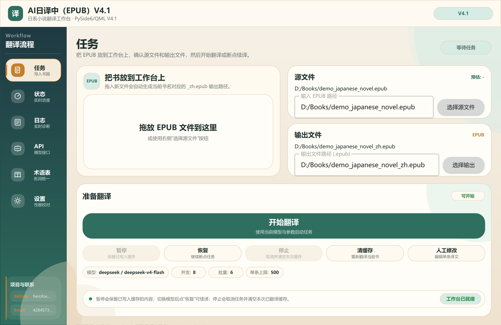
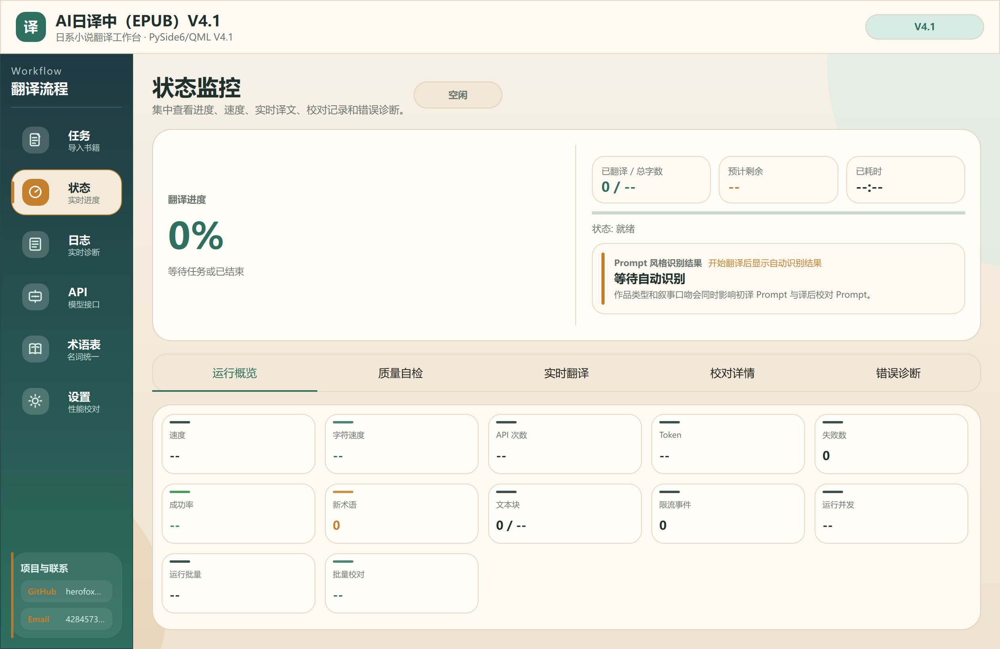
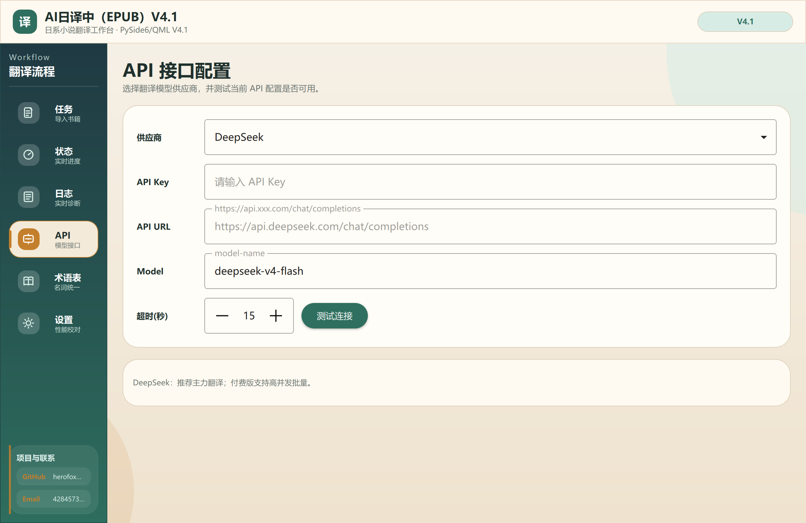
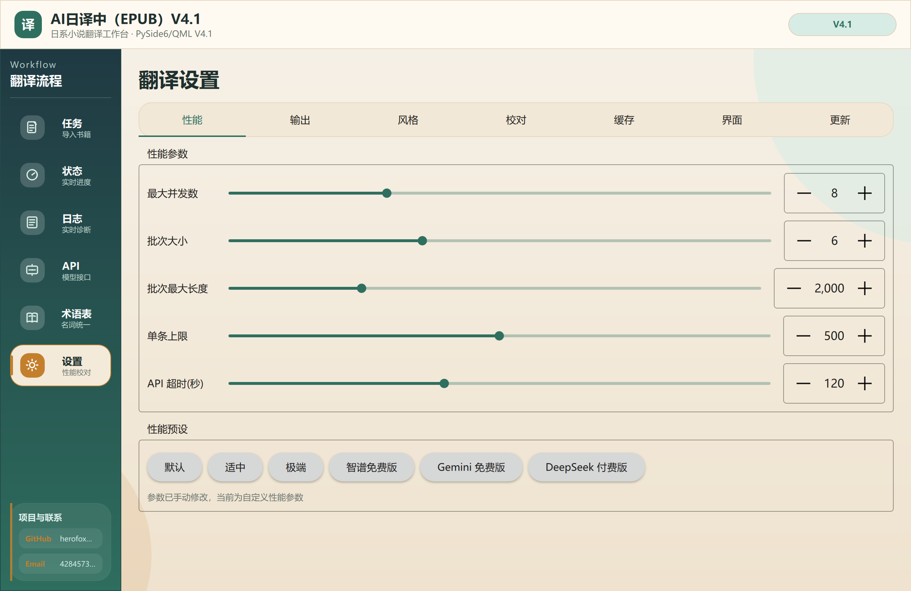

<div align="center">


# AI日译中（EPUB）

基于大模型 API 的日文 EPUB 自动翻译工具，面向轻小说、推理小说、科幻小说等日文电子书场景，支持翻译、术语表、缓存续译、译后校对和 Windows 桌面安装包。


**Language:** [简体中文](README.md) | [English](README_EN.md)

**当前主力版本：QML/V4.1**  
**稳定回退版：Qt V3.2.1**

</div>

---

## 文档导航

| 内容 | 说明 |
|------|------|
| [版本定位](#版本定位) | 当前主线、回退版、历史入口的维护策略 |
| [界面预览](#界面预览) | QML/V4.1 主要页面截图 |
| [核心功能](#核心功能) | EPUB 翻译、术语表、缓存续译、译后校对 |
| [快速开始](#快速开始) | 安装包运行和源码运行方式 |
| [使用流程](#使用流程) | 从选择 EPUB 到生成中文 EPUB 的步骤 |
| [API 配置](#api-配置) | 支持的大模型供应商和免费版参数建议 |
| [翻译设置](#翻译设置) | 性能参数、小说风格、译后校对、术语表 |
| [缓存与续译](#缓存与续译) | 暂停、恢复、停止、换模型重译的行为说明 |
| [项目结构](#项目结构) | 当前代码目录和入口文件 |
| [打包说明](#打包说明) | PyInstaller 和 Inno Setup 打包命令 |
| [GitHub 自动发布](#github-自动发布) | 推送版本标签后自动打包并发布安装包 |
| [常见问题](#常见问题) | 限流、缓存、目录未翻译、启动慢等问题 |
| [版本记录](#版本记录) | V4.1 与历史版本摘要 |

---

## 版本定位

| 版本 | 入口 | 状态 | 说明 |
|------|------|------|------|
| QML/V4.1 | `experimental/qml_v4/main.py` | 当前主力版本 | P0-P3 架构改造 + 性能优化 |
| Qt V3.2.1 | `main_qt.py` | 稳定回退版 | 进入维护模式，只修 P0/P1 严重问题 |
| Tk 旧版 | `app.py` | 冻结兼容 | 仅保留兼容测试或阻断性修复 |

说明：`experimental/qml_v4/` 是历史目录名。V4.1 阶段暂不改目录，避免影响已有打包脚本、安装脚本和用户路径。

---

## 界面预览

| 任务页 | 状态监控 |
|--------|----------|
|  |  |

| API 配置 | 翻译设置 |
|----------|----------|
|  |  |

---

## 核心功能

- **EPUB 日译中**：翻译正文、标题、列表、引用等常见 HTML 内容，尽量保留原书结构。
- **目录与链接处理**：支持 NCX/nav 目录翻译、短文本书内目录链接翻译，并保留 `href` 跳转关系。
- **多大模型供应商**：支持 DeepSeek、豆包、Sakura、Hy-MT2 本地、Gemini、智谱 GLM、文心一言、LongCat 2.0 和自定义 OpenAI 兼容接口。
- **内容审核备用模型**：主模型遇到 `security_audit_fail` / `contentFilter` 等内容审核拦截时，可自动使用校对模型配置作为备用 provider 翻译该段。
- **缓存续译**：相同文本命中缓存后不重复请求 API，支持暂停后恢复翻译。
- **模型隔离缓存**：切换大模型后可避免直接复用旧模型译文，便于重新翻译。
- **术语表管理**：支持启用/禁用术语表、导入、增量导入、重复过滤、编辑、来源显示和自动提取。
- **译后校对**：检查日文残留、可疑译文和术语不一致，可展示原文、初译、校对后译文和触发原因；校对 API 认证失败会自动熔断，避免重复 401/403 请求。
- **小说风格 Prompt**：支持作品类型和叙事口吻设置，可用于初译和译后校对提示词。
- **短句上下文缓存**：日文短句会按前后文区分缓存，减少重复短句因语境不同导致的误复用。
- **状态监控**：展示实时进度、已翻译字数、总字数、预计剩余时间、速度、API 次数、Token 和失败数。
- **EPUB 兼容增强**：对 `body/br` 排版 EPUB、短目录页、Ruby 注音、图片占位文本、空 XHTML、直接文本 body 和 ebooklib page-list 写出问题做了兼容处理。
- **Windows 安装包**：支持 onedir 瘦身打包，并可通过 Inno Setup 制作安装程序。
- **应用内更新**：设置页可检查 GitHub Release 最新版本，直接下载安装包并启动更新。
- **Toast 通知 (P0)**：非阻塞浮层消息，操作完成/失败/警告即时反馈。
- **翻译管线 (P1)**：Pipeline 阶段抽象，风格检测等步骤可独立开关配置。
- **服务容器 (P1)**：ServiceContainer 依赖注入，分阶段初始化，统一管理后端实例。
- **运行时主题切换 (P2)**：ThemeRegistry 主题注册表，切换时平滑过渡 + Toast 通知。

---

## 快速开始

### 方式一：使用安装包

已打包的 RC1 安装程序位于：

```text
dist/installer/AI日译中(EPUB)V4.1 安装程序.exe
```

安装后从开始菜单或桌面快捷方式启动即可。

### 方式二：从源码运行 QML/V4.1

```powershell
pip install -r experimental/qml_v4/requirements.txt
python experimental/qml_v4/main.py
```

### 方式三：运行稳定回退版 Qt V3.2.1

```powershell
pip install -r requirements.txt
python main_qt.py
```

### 方式四：历史 Tk 入口

```powershell
python app.py
```

Tk 入口已冻结，不建议日常使用。

---

## 使用流程

1. 打开软件，进入「任务」页。
2. 拖入或选择需要翻译的日文 EPUB。
3. 确认输出 EPUB 路径。
4. 进入「API」页，选择服务提供方，填写 API Key、Base URL 和模型名。
5. 进入「设置」页，选择性能参数、小说风格、是否启用译后校对。
6. 如需固定专有名词，进入「术语表」页启用术语表并导入或编辑术语。
7. 回到「任务」页点击开始翻译。
8. 在「状态」页查看实时进度、预计剩余时间、速度、API 次数和校对详情。
9. 翻译完成后，用 EPUB 阅读器检查目录、章节跳转和排版。

---

## API 配置

| 供应商 | 默认用途 | 说明 |
|--------|----------|------|
| DeepSeek | 推荐主力翻译 | 速度和质量较稳定，适合长篇 EPUB |
| 豆包 Doubao | 通用翻译 | 需要火山引擎 API Key |
| Sakura | 本地/自建服务 | 兼容 OpenAI `chat/completions` 的本地服务 |
| Gemini | 免费/付费 API | 免费版容易限流，部分参数不支持 `thinking` 字段 |
| 智谱 GLM | 免费/付费 API | 免费版限流明显，建议低并发小批量 |
| 文心一言 | 兼容供应商 | 需填写可用 API Key、Base URL 和模型名 |
| LongCat 2.0 | 兼容供应商 | 默认接口 `https://api.longcat.chat/openai/v1/chat/completions`，默认模型 `LongCat-2.0` |
| Custom | 自定义接口 | 适合代理网关或其他 OpenAI 兼容服务 |

API Key 可以在界面填写，也可以通过环境变量读取。LongCat 对应环境变量为 `LONGCAT_API_KEY`。

### 免费版参数建议

免费模型通常不是不能用，而是并发和批量必须保守：

| 场景 | 并发数 | 批量大小 | 单条字符上限 | 批量总字符 | 超时 |
|------|--------|----------|--------------|------------|------|
| 智谱 GLM 免费版 | `1` | `2-3` | `200` 左右 | `200` 左右 | `300` 秒 |
| Gemini 免费版 | `1` | `2-3` | `200` 左右 | `200` 左右 | `300` 秒 |
| LongCat 2.0 | `1-8` | `2-9` | 按稳定性调整 | 按稳定性调整 | `300` 秒 |
| DeepSeek 付费版 | 可提高 | 可提高 | 可提高 | 可提高 | 按网络情况调整 |

注意：Gemini 免费版即使使用与智谱 GLM 相同的保守参数，也可能触发 API 限流。长篇 EPUB 建议优先使用付费大模型。

LongCat 2.0 已做稳定性保护：并发会自动限制到 `8` 以内，批量大小会自动限制到 `9` 以内，避免 UI 参数过高导致连续失败。

---

## 翻译设置

### 性能参数

V4.1 支持 Slider + SpinBox 精确调节，并提供模型参数预设。

| 参数 | 作用 | 建议 |
|------|------|------|
| 并发数 | 同时请求 API 的任务数量 | 免费模型填 `1`，付费模型按限额提高 |
| 批量大小 | 每次请求合并的文本条数 | 免费模型 `2-3`，付费模型可更高 |
| 单条字符上限 | 单个文本块过长时的切分阈值 | 长句多的小说可适当提高 |
| 批量总字符 | 单次批量请求最大字符数 | 免费模型保守，付费模型按稳定性调整 |
| API 超时 | 单次请求等待时间 | 网络慢或免费模型建议 `300` 秒 |

### Hy-MT2 本地模型

QML/V4 支持将腾讯 Hy-MT2-1.8B GGUF 作为本地 OpenAI 兼容 provider 使用。入口在「API」页：

- 可以直接填写 `hymt2` provider，也可以在「Hy-MT2 本地模型」区域下载 GGUF 模型。
- 默认下载目录：`~/.epub_translator/models/hymt2/`。
- 下载使用 `.part` 临时文件，取消后可再次点击继续断点下载。
- 如果 HuggingFace 因代理或网络超时失败，可点击「使用镜像」切换到 `hf-mirror.com`；也可以手动下载 GGUF 后在页面选择本地文件。
- 现在默认从官方 `tencent/Hy-MT2-1.8B-GGUF` 仓库下载 `Hy-MT2-1.8B-Q4_K_M.gguf`，这是当前已验证能被 llama 加载的版本。
- `1.25bit/2bit` GGUF 当前 llama 不支持，默认不再推荐下载；如果手动选择这类文件，可能出现 `gguf_init_from_reader ... offset ... expected` 并导致服务退出。
- `Hy-MT2-7B-GGUF` 可以手动选择作为高级本地模型，但不建议默认下载；CPU 运行会很慢，建议至少有可用 NVIDIA 显卡和足够内存后再测试。
- 现在支持两种本地运行方式：
  - **Python 本地模式**：由软件直接通过 `llama-cpp-python` 加载 GGUF，不需要 `llama-server.exe`。
  - **llama-server.exe 模式**：继续兼容外部 `llama-server` 启动方式。
- Python 本地模式会启动内置 OpenAI 兼容服务，默认监听 `http://127.0.0.1:8080/v1/chat/completions`。
- GPU 模式支持「自动 / CUDA / CPU」：
  - 自动模式会先检测 `nvidia-smi`，有 NVIDIA 显卡则尝试 CUDA。
  - 如果 CUDA 加载失败，会自动回退到 CPU。
  - 集成显卡或未安装 CUDA 版 `llama-cpp-python` 时，会按 CPU 启动。
- 点击「应用到 Hy-MT2 配置」会自动切换 provider、URL 和模型名。

Hy-MT2 默认使用本地稳定模式。CPU 模式强制并发 `1`、批量 `1`、API 超时至少 `300` 秒，适合离线初译、隐私场景或内容审核备用，不建议默认替代云模型承担最终校对。

如果使用 CPU 运行 Python 本地模式，不建议手动提高并发或批量；本地服务内部会串行推理，较高并发只会增加超时和断连概率。

如果使用 CUDA/GPU 运行 Hy-MT2-1.8B Q4，例如 RTX 2070 8GB + 32GB 内存，推荐从并发 `4`、批量 `4` 开始。QML/V4 会在应用 Hy-MT2 GPU 配置时自动设置 `4/4`，翻译器内部最大允许并发 `6`、批量 `8`。如果出现 OOM、超时、断连或日文残留变多，建议退回 `4/4` 或 `3/4`。

Hy-MT2 本地模型页提供「生成模式」：

- **稳定模式（默认）**：`temperature=0.1`、`top_p=0.3`，不额外传 `top_k`、`repetition_penalty`、`max_tokens`，优先保证稳定保存。
- **官方推荐模式**：`temperature=0.7`、`top_p=0.6`、`top_k=20`、`repetition_penalty=1.05`、`max_tokens=4096`，更贴近官方示例，但可能增加超时、残留或格式失控，需要按机器性能实测。

Hy-MT2 本地模型页还提供「Prompt 模式」：

- **官方简洁模板（默认）**：不使用 system prompt，按官方示例使用短 user prompt：`将以下日语文本翻译为简体中文，注意只需要输出翻译后的结果，不要额外解释`。术语按 `原词 翻译成 译词` 的格式注入。
- **项目文学模板**：沿用 QML/V4 原有复杂文学翻译 prompt。表达约束更细，但 Hy-MT2 1.8B 小模型更容易出现日文残留或格式失控。

注意：Python 本地模式依赖 `llama-cpp-python`。如果你当前环境只有 Python 3.13，而对应 CUDA/CPU wheel 不可用，建议继续使用 `llama-server.exe` 模式，或者换到有可用 wheel 的 Python 版本再启用 Python 本地模式。

### 小说风格 Prompt

当前支持两类设置：

- **作品类型**：自动识别、通用小说、推理小说、科幻小说、幻想/异世界。
- **叙事口吻**：自动识别、中性叙事、轻小说风格、文学叙事。

风格设置会影响初译和译后校对的提示词。自动识别基于书名、目录和样本文本做本地判断，不额外消耗 API Token。

### 译后校对

译后校对用于质量修复，不是无限制自由润色。当前重点检查：

- 是否存在日文残留。
- 专有名词是否与术语表不一致。
- 初译是否明显漏译或格式异常。
- 校对后译文是否保留原意。

如果使用免费模型做校对，翻译时间和 Token 消耗都会增加，并且更容易遇到限流。

校对模型也可以作为内容审核备用 provider：当主模型返回 `security_audit_fail`、GLM `contentFilter/code=1301` 或敏感内容拦截时，单段翻译会尝试使用校对模型配置重译。这里复用的是校对模型的 API 配置，但提示词仍按翻译任务生成，不会把该段当作校对任务处理。如果备用 provider 和主 provider 不同，需要单独配置备用 provider 的 API Key，否则会跳过并在日志中记录原因。

片假名残留按两类处理：应该译成中文的器物名、外来语或专有名词，加入「设置 -> 校对 -> 片假名术语修复词表」；确实必须保留日文的字形、谜题、符号或原文标记，才加入「日文残留白名单」。修复词表默认路径为 `~/.epub_translator/known_katakana_terms.json`，白名单默认路径为 `~/.epub_translator/japanese_residue_allowlist.json`。

### 术语表

默认术语表路径：

```text
~/.epub_translator/glossary.json
```

术语表示例：

```json
{
  "能面島": "能面岛",
  "女学生探偵シリーズ": "女学生侦探系列",
  "魔王": "魔王"
}
```

术语表页面支持：

- 启用/禁用术语表。
- 导入术语表 JSON。
- 增量导入并过滤重复项。
- 直接编辑术语内容。
- 显示来源：自动提取、手动导入、未知来源。
- 设置应用策略：默认策略、强制使用、仅供参考、忽略校对。

应用策略说明：

- `默认策略`：按分类和来源自动判断，人物/地点/组织等通常会强制，自动提取术语更偏参考。
- `强制使用`：校对阶段会检查原文独立命中时是否按该译名翻译。
- `仅供参考`：只作为翻译提示参考，不在校对阶段强行替换。
- `忽略校对`：不进入翻译提示词，也不触发术语校对，适合容易误伤的普通词。

---

## 缓存与续译

默认缓存路径：

```text
~/.epub_translator/cache.json
```

行为说明：

- 点击「暂停」后，当前已经完成的译文会保留，后续可点击「恢复」继续。
- 点击「停止」用于结束当前任务，并清空本次 UI 中的实时翻译状态。
- 已写入缓存的文本下次会直接命中，不重复请求 API。
- 如果想换大模型重新翻译，需要使用模型隔离缓存或清理对应缓存，否则相同文本可能继续复用旧译文。
- 当前书籍清理缓存会先加载磁盘 `cache.json`，再删除当前书相关缓存；选择跨模型清理时，会同时删除旧版明文 key、哈希 key 和不同模型下的同源文本缓存。
- 遇到 429 限流时，可以降低并发/批量后重新开始，已翻译内容会优先命中缓存。

日志路径：

```text
~/.epub_translator/logs/app-YYYYMMDD.log
```

---

## 项目结构

```text
.
├─ experimental/qml_v4/        # QML/V4.1 当前主力版本
│  ├─ main.py                  # V4 启动入口（PySide6 + QML）
│  ├─ qml_smoke_test.py        # QML 无窗口加载检查脚本
│  ├─ qml/                     # QML 页面与主题
│  │  ├─ main.qml              # 主窗口（导航栏、页面切换、主题绑定）
│  │  ├─ AppPalette.qml        # 全局调色板（Light/Dark/Glass 三态响应式）
│  │  ├─ AppStyle.qml          # 全局视觉 Token（字体、间距、按钮高度、状态背景）
│  │  ├─ pages/                # 5 个功能页面
│  │  │  ├─ TaskPage.qml       # 任务页（EPUB 拖入、开始/暂停/停止）
│  │  │  ├─ MonitorPage.qml    # 状态页（进度、统计、校对详情）
│  │  │  ├─ ApiConfigPage.qml  # API 配置页（供应商、Key、连接测试）
│  │  │  ├─ GlossaryPage.qml   # 术语表页（CRUD、导入导出、搜索筛选）
│  │  │  └─ OptionsPage.qml    # 设置页（性能、风格、校对、主题）
│  │  └─ components/           # 可复用组件
│  │     ├─ Toast.qml          # Toast 通知浮层（P0 新增）
│  │     └─ ThemeRegistry.qml  # 主题注册表工具（P2 新增）
│  ├─ backend/                 # Python-QML 桥接层
│  │  ├─ config_bridge.py      # 配置桥接（Qt Property → QML 绑定）
│  │  ├─ translate_bridge.py   # 翻译桥接（QThread Worker + Pipeline）
│  │  ├─ glossary_bridge.py    # 术语表桥接（QAbstractListModel）
│  │  ├─ toast_bridge.py       # Toast 信号桥接（P0 新增）
│  │  ├─ pipeline.py           # 翻译管线阶段抽象（P1 新增）
│  │  └─ service_container.py  # 服务容器依赖注入（P1 新增）
│  ├─ assets/                  # V4 图标资源
│  └─ EPUBTranslator*.spec     # PyInstaller 打包配置
├─ ui/qt_app.py                # Qt V3.2.1 回退版 UI
├─ main_qt.py                  # Qt V3.2.1 启动入口
├─ app.py                      # Tk 历史兼容入口，冻结维护
├─ translator.py               # 翻译核心：API、批处理、缓存、术语、校对
├─ epub_io.py                  # EPUB 读取、写入、目录和排版兼容
├─ style_detector.py           # 小说类型和叙事风格本地识别
├─ glossary_store.py           # 术语表加载、保存、合并、去重
├─ cache_store.py              # 缓存和 JSON 原子写入
├─ text_utils.py               # 文本可翻译性判断
├─ installer/                  # Inno Setup 脚本
└─ tests/                      # 回归测试
```

### 架构概览

```
┌──────────────────────────────────────────────────────────────┐
│                      QML UI 层 (PySide6)                      │
│  TaskPage  MonitorPage  ApiConfigPage  GlossaryPage  Options  │
│    │  │        │              │              │           │    │
├────┼──┼────────┼──────────────┼──────────────┼───────────┼────┤
│    │  │        │              │              │           │    │
│    ▼  ▼        ▼              ▼              ▼           ▼    │
│  TranslateBridge  GlossaryBridge  ConfigBridge  ToastBridge  │
│  ┌─────────────┐ ┌────────────┐ ┌──────────┐ ┌───────────┐  │
│  │QThread      │ │QListModel  │ │Qt Props  │ │Signal     │  │
│  │Worker.run() │ │CRUD        │ │Save/Load │ │info/succ/ │  │
│  │             │ │            │ │          │ │warn/err   │  │
│  └──────┬──────┘ └─────┬──────┘ └────┬─────┘ └─────┬─────┘  │
├─────────┼──────────────┼─────────────┼─────────────┼────────┤
│         ▼              ▼             ▼             ▼        │
│  ┌──────────────────────────────────────────────────────┐    │
│  │              Python 业务逻辑层                        │    │
│  │                                                      │    │
│  │  ┌─────────────────┐  ┌──────────────────────────┐  │    │
│  │  │ ServiceContainer│  │  TranslationPipeline     │  │    │
│  │  │ init_light()    │  │  StyleDetectStage        │  │    │
│  │  │ init_heavy()    │  │  当前仅承载风格检测       │  │    │
│  │  │ get_translator()│  │  翻译/缓存/校对在引擎层   │  │    │
│  │  └─────────────────┘  └──────────────────────────┘  │    │
│  │                                                      │    │
│  │  ┌──────────────────────────────────────────────┐    │    │
│  │  │           JaZhTranslator (核心引擎)            │    │    │
│  │  │  translate_batch()                            │    │    │
│  │  │  ┌─────────────────────────────────────────┐ │    │    │
│  │  │  │ 缓存查找 → 分批 → API调用(7家LLM)        │ │    │    │
│  │  │  │ 术语替换 → 质检 → 校对修复 → 术语提取    │ │    │    │
│  │  │  │ → 进度/统计/校对详情 实时信号发射         │ │    │    │
│  │  │  └─────────────────────────────────────────┘ │    │    │
│  │  └──────────────────────────────────────────────┘    │    │
│  │                                                      │    │
│  │  ┌──────────────────┐  ┌─────────────────────────┐  │    │
│  │  │   epub_io.py     │  │   Supporting Modules    │  │    │
│  │  │  load / save     │  │  style_detector.py      │  │    │
│  │  │  iter_text_nodes │  │  glossary_store.py      │  │    │
│  │  │  extract_toc     │  │  cache_store.py         │  │    │
│  │  └──────────────────┘  └─────────────────────────┘  │    │
│  └──────────────────────────────────────────────────────┘    │
│                                                              │
│  ┌──────────────────────────────────────────────────────┐    │
│  │              外部 API 层                              │    │
│  │  DeepSeek | Doubao | Sakura | Gemini | GLM | Wenxin │    │
│  └──────────────────────────────────────────────────────┘    │
└──────────────────────────────────────────────────────────────┘
```

### 翻译流程（从点击到完成）

```
用户点击"开始翻译"
    │
    ▼
TaskPage.tbridge.startTranslation(cfg)
    │ Slot("QVariant")
    ▼
TranslateBridge._make_config() → 参数校验 → ToastBridge.info("正在加载...")
    │ 创建 _TranslateWorker + QThread
    ▼
_TranslateWorker.run() [QThread 中执行]
    │
    ├─ ① EPUB 解析: load_book() → iter_text_nodes() → extract_toc_titles()
    ├─ ② 文本提取: 遍历 HTML → is_translatable() 筛选 → all_texts[]
    ├─ ③ 风格检测: StyleDetectStage → detect_novel_style() (P1 管线阶段)
    ├─ ④ 创建翻译器: JaZhTranslator(provider, model, glossary, proofread...)
    ├─ ⑤ 预估时间: _estimate_translation_duration()
    ├─ ⑥ 批量翻译: translator.translate_batch(all_texts)
    │     └─ 缓存命中 → 分批 → ThreadPoolExecutor → LLM API
    │         └─ 术语替换 → 质检 → 校对 → 术语提取 → 缓存保存
    │         └─ 实时信号: progressChanged / statUpdate / itemTranslated / proofreadDetail
    ├─ ⑦ 结果回写: 译文 → HTML 标签替换
    ├─ ⑧ 目录翻译: apply_toc_translations()
    ├─ ⑨ 保存 EPUB: save_book() + 智能文件名
    └─ ⑩ 完成: finished.emit() → ToastBridge.success("翻译完成!") + TTS 语音

暂停: cancel_event.set() → 当前批次完成后等待 → resumeTranslation() 新线程继续
停止: cancel_event.set() + discard_cache_writes() → 清理本次缓存
```

### 信号流向（Python ↔ QML）

```
Python 端信号                    QML 端接收
═══════════════                 ═══════════
progressChanged(completed,total,chars) → MonitorPage 进度条
statUpdate(10个统计参数)        → MonitorPage 统计面板
itemTranslated(src,dst)         → MonitorPage 实时译文滚动
proofreadDetail(7个校对参数)    → MonitorPage 校对详情列表
proofreadStyleDetected(4个参数) → MonitorPage 风格标识
statusChanged(msg)              → MonitorPage 状态文字
finished(out_path)              → TaskPage 按钮恢复
failed(err)                     → TaskPage 错误提示

ToastBridge.showInfo(msg)       → Toast 蓝色浮层 (P0)
ToastBridge.showSuccess(msg)    → Toast 绿色浮层 (P0)
ToastBridge.showWarning(msg)    → Toast 橙色浮层 (P0)
ToastBridge.showError(msg)      → Toast 红色浮层 (P0)

ConfigBridge.theme              → AppPalette 颜色响应式更新 (P2)
  └─ onThemeChanged             → Toast 通知 + 保存磁盘
```

---

## 打包说明

### PyInstaller onedir 瘦身打包

```powershell
python -m PyInstaller experimental\qml_v4\EPUBTranslator_onedir_slim.spec --noconfirm
```

输出目录：

```text
dist/AI日译中(EPUB)V4.1_slim/
```

### Inno Setup 安装包

使用 Inno Setup 6 编译 `installer/EPUB日译中V4.0_slim.iss`。

常见路径：

```powershell
& "C:\Users\HUAWEI\AppData\Local\Programs\Inno Setup 6\ISCC.exe" "installer\EPUB日译中V4.0_slim.iss"
```

输出安装包：

```text
dist/installer/AI日译中(EPUB)V4.1 安装程序.exe
```

---

## GitHub 自动发布

项目已添加 GitHub Actions 工作流：

```text
.github/workflows/release-qml-v4.yml
```

触发方式：

- 推送 `v*` 版本标签时，自动在 Windows Runner 上打包 QML/V4.1。
- 自动生成 onedir 便携压缩包和 Inno Setup 安装程序。
- 自动生成发布说明：优先读取 `CHANGELOG.md` 中对应版本小节，再追加 Git 提交摘要。
- 自动创建 GitHub Release，并把 `.exe` 安装包和 `.zip` 便携包挂到 Release 资产里。
- 手动运行 `workflow_dispatch` 时只上传 Actions 构建产物，不自动发布 Release。

发布前填写修改内容：

```markdown
## v4.1.2

- 修复 xxx 问题。
- 优化 xxx 流程。
- 新增 xxx 功能。
```

说明：版本小节标题需要和发布标签一致，例如标签 `v4.1.2` 对应 `CHANGELOG.md` 里的 `## v4.1.2`。如果没有填写对应小节，Release 会显示“未填写人工发布说明”，但仍会附加提交摘要。

发布新版本示例：

```powershell
git tag v4.1.0
git push origin v4.1.0
```

自动构建流程：

1. 安装 `experimental/qml_v4/requirements.txt` 里的 QML/V4 运行依赖。
2. 安装 `pyinstaller` 和 `pyinstaller-hooks-contrib`。
3. 执行 `experimental/qml_v4/EPUBTranslator_onedir_slim.spec` 生成瘦身 onedir。
4. 通过 Chocolatey 安装 Inno Setup。
5. 编译 `installer/EPUB日译中V4.0_slim.iss` 生成安装程序。
6. 上传 `dist/installer/*.exe` 和 `dist/*.zip`。

注意：安装包名称仍由现有 Inno Setup 脚本控制，当前输出为：

```text
AI日译中(EPUB)V4.1 安装程序.exe
```

### 应用内检查更新

V4.1 设置页提供「软件更新」区域：

- 点击「检查更新」会读取 GitHub 最新 Release。
- 发现新版本后可打开发布页查看说明。
- 点击「下载并安装」会把安装包下载到 `~/.epub_translator/updates/`。
- 下载完成后自动启动安装程序，并退出当前软件。

说明：应用内更新依赖公开 GitHub Release 资产。如果仓库或 Release 是私有的，用户仍需要登录 GitHub 或改用自建更新源。

---

## 常见问题

### 为什么启动比较慢？

QML/PySide6、EPUB 解析、配置加载和 Python 运行时初始化都会增加启动时间。V4 已做过优化：启动动画、页面懒加载、术语表延迟加载、重模块延迟导入。首次启动仍可能比普通原生软件慢。

### 为什么免费模型经常 429 或超时？

免费 API 通常有请求频率、并发、Token 和每日额度限制。把并发降到 `1`，批量降到 `2-3`，单条字符和批量总字符控制在 `200` 左右，再重试。

### 为什么换了大模型，输出还是旧译文？

通常是缓存命中导致。相同原文如果已经缓存，下次会直接复用译文。需要使用模型隔离缓存或清理旧缓存后再翻译。

### 为什么清空缓存后仍像是从缓存翻译？

旧版本同时存在明文缓存 key、哈希缓存 key 和模型隔离缓存 key。如果只删除其中一种，当前书再次翻译时仍可能命中残留缓存。新版当前书缓存清理会先读取磁盘缓存，再按当前书文本删除旧版明文 key、哈希 key；跨模型清理会连同不同模型下的同源文本缓存一起删除。

### 为什么目录页还有日文？

部分 EPUB 的目录不是标准 NCX/nav，而是正文里的短链接列表。V4 已增加短书内目录链接翻译逻辑，但极端排版仍建议翻译后人工检查目录页。

### 为什么预估字符数很少？

有些 EPUB 使用 `body/br` 或非标准 HTML 排版，正文不在常见段落标签里。V4 已增加 fallback 提取逻辑，用于改善这类 EPUB 的字符统计和翻译覆盖。

### 为什么校对后和初译差不多？

校对目标是修复漏译、日文残留、术语错误和明显异常，不是默认大幅改写。如果初译已经可用，校对结果可能变化很小。

### LongCat 返回 `security_audit_fail` 或日志显示“未返回安全译文”怎么办？

这表示供应商的内容安全审核暂停了输出，不是本地解析失败。可以在设置里开启译后校对，并把校对模型配置为另一个可用 provider；主模型遇到审核拦截时，会尝试用校对模型配置作为备用 provider 翻译该段。如果备用 provider 和主 provider 不同，需要填写备用 provider 的 API Key。

### 为什么校对模型 401/403 后不继续重试？

401/403 表示 API Key、权限或模型访问配置错误，继续请求只会重复失败并浪费时间。新版会对校对请求做任务级熔断，第一次确认认证失败后跳过后续校对请求，主翻译流程不因此反复卡住。

### 为什么保存前提示 `チロリ` 这类片假名残留？

这类通常不是“应该保留的日文”，而是模型把器物名或外来语半翻译了。处理方式是到「设置 -> 校对 -> 片假名术语修复词表」添加 `片假名原词 -> 中文译名`，例如 `チロリ -> 烫酒壶`。保存前检查会先自动应用修复词表，再执行日文残留拦截。

### 为什么翻译结束时报 `Document is empty`，生成的 EPUB 打不开？

通常是 EPUB 内存在空 XHTML、直接文本 body 或 ebooklib 写出 EPUB3 `page-list` 时触发的兼容问题。新版解析阶段会跳过空 XHTML，保存阶段会禁用易出错的 `page-list` 自动生成，并先写入临时 EPUB，成功后再原子替换目标文件，避免留下半写入的坏文件。

### API 报“响应缺少 choices 字段”是什么意思？

通常表示供应商返回的不是 OpenAI 兼容 `chat/completions` 格式，可能是 Base URL 填错、模型名不可用、鉴权失败、余额不足或供应商错误页。先检查日志中的完整响应。

---

## 回归建议

发布前建议至少跑三类 EPUB：

- 普通章节型 EPUB。
- `body/br` 或非标准排版 EPUB。
- 大术语表 EPUB，验证术语召回、缓存和速度。

每次回归重点检查：

- 输出 EPUB 能否打开。
- 目录和章节跳转是否正常。
- 第 1-10 页是否存在明显日文残留。
- 术语是否一致。
- 暂停、恢复、停止是否符合预期。
- 日志是否存在连续 API 错误。

开发验证命令：

```powershell
python experimental/qml_v4/qml_smoke_test.py
python -m pytest -q
```

---

## 版本记录

### V4.1

- QML/V4 从候选版正式发布为 V4.1 主力版本。
- **架构改造 (P0/P1/P2/P3)**：Toast 通知、翻译管线、服务容器、主题切换、智能分批、上下文窗口、预翻译规则、文本级缓存、校对分级、双模型流水线、流式处理。
- README、启动标题、安装包命名统一为 `AI日译中(EPUB)V4.1`。
- 增加 iOS26 玻璃主题、深色主题修正、导航和状态页视觉优化。
- 增加启动动画、页面懒加载、术语表延迟加载和重模块延迟导入。
- 增加停止按钮、暂停恢复续译、状态页预计翻译时长/预计剩余时间。
- 增加文心一言供应商。
- 增加 LongCat 2.0 供应商，内置官方 OpenAI 兼容接口、默认模型和 `LONGCAT_API_KEY` 环境变量读取。
- 增加 Hy-MT2 本地 provider，支持在 API 页下载 GGUF 模型、Python 本地模式、`llama-server` 模式、GPU 自动检测与 CPU 回退，并可一键应用配置。
- 增加内容审核备用模型机制，主模型遇到 `security_audit_fail` / `contentFilter` 等审核拦截时，可使用校对模型配置重译单段。
- 增加小说风格设置和本地风格识别，风格可影响初译和译后校对 Prompt。
- 修复当前书清理缓存不完整的问题，覆盖旧版明文 key、哈希 key 和跨模型同源文本缓存。
- 增强 `body/br` 排版 EPUB 的字符统计和正文提取。
- 增强短目录页和书内 HTML 链接文本翻译。
- 增强 EPUB 保存稳定性，兼容空 XHTML、直接文本 body 和 ebooklib `page-list` 写出异常，并改为临时文件成功后替换。
- 增加片假名术语修复词表，保存前自动修复 `チロリ` 这类应译成中文的片假名残留，并在设置页提供可编辑入口。
- 优化校对和质检日志：校对 401/403 自动熔断，GLM `contentFilter/code=1301` 识别为审核拦截，弱日文残留规则减少 `S・K`、解释性日文书名等误报。
- QML 翻译任务异常改为记录完整堆栈，便于定位失败原因。
- 提供 onedir 瘦身打包和 Inno Setup 安装包。

### Qt V3.2.1

- 作为稳定回退版保留。
- 已进入维护模式，仅修 P0/P1 严重问题。
- 保留 API 配置、术语表、缓存、暂停恢复、状态监控等成熟功能。

### 历史版本摘要

- V3.2 系列：Qt UI 主线阶段，完善术语表、缓存续译、校对详情、性能参数和安装包。
- V3.1 系列：引入 Qt 版本并逐步替代 Tk UI。
- V2.x 系列：完成多页面桌面 UI、状态监控和基础打包。
- V1.x 系列：完成 EPUB 翻译、API 调用、缓存、术语表和基础 GUI。

---

## License

本项目用于个人学习和本地 EPUB 翻译工作流。请遵守原书版权、API 服务商条款和所在地区法律法规。不要传播未授权的翻译成品。
## Star History

<a href="https://www.star-history.com/?repos=herofox2024%2Fjptoch&type=date&legend=top-left">
 <picture>
   <source media="(prefers-color-scheme: dark)" srcset="https://api.star-history.com/chart?repos=herofox2024/jptoch&type=date&theme=dark&legend=top-left" />
   <source media="(prefers-color-scheme: light)" srcset="https://api.star-history.com/chart?repos=herofox2024/jptoch&type=date&legend=top-left" />
   
 </picture>
</a>
